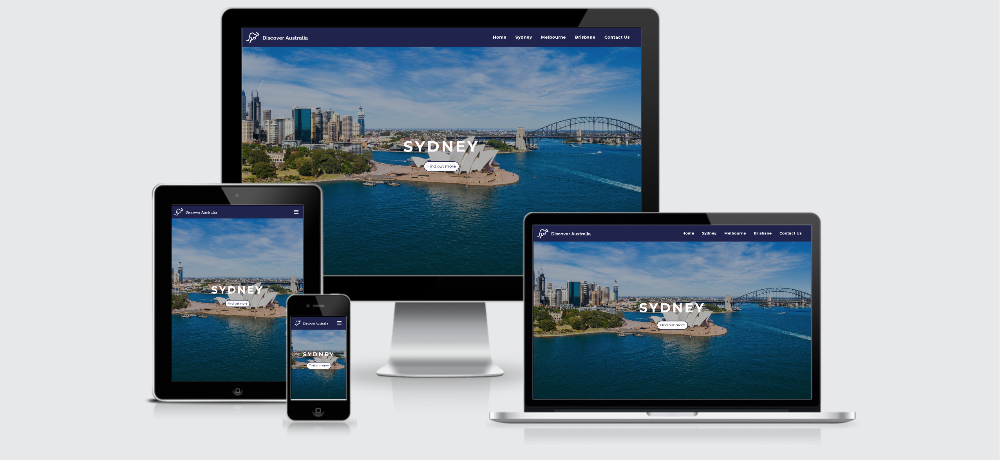
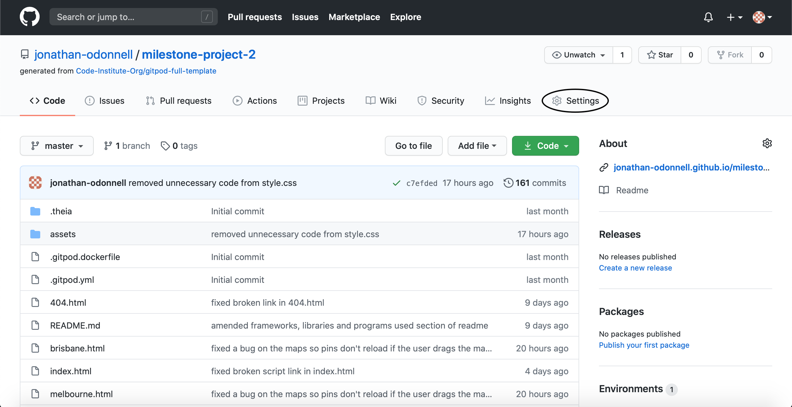
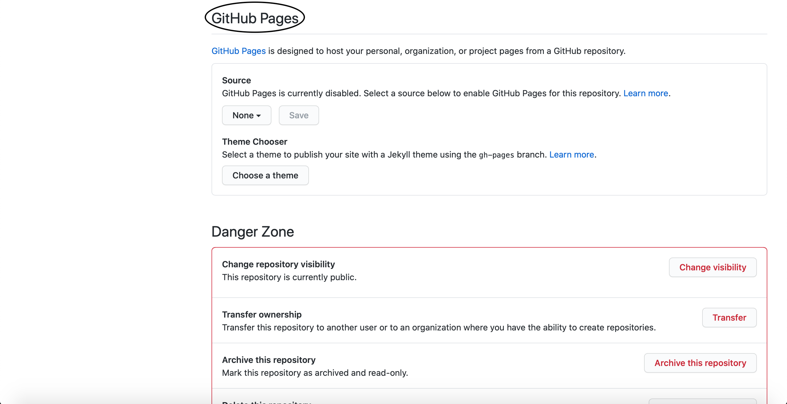
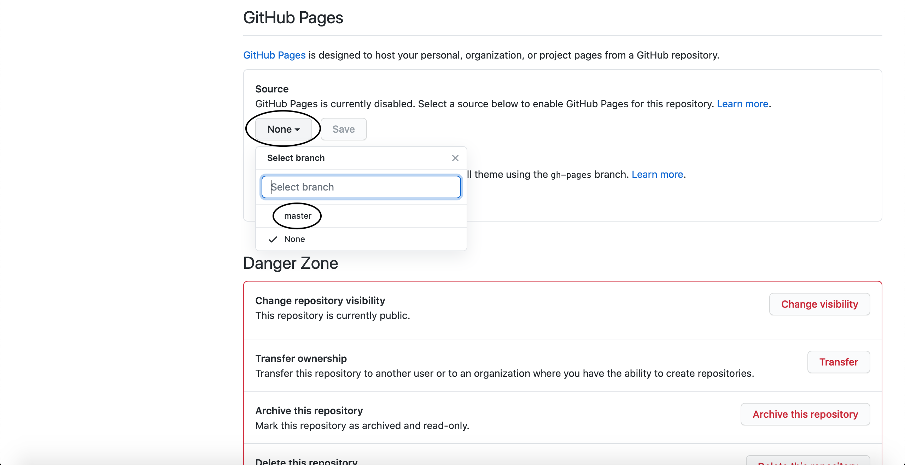
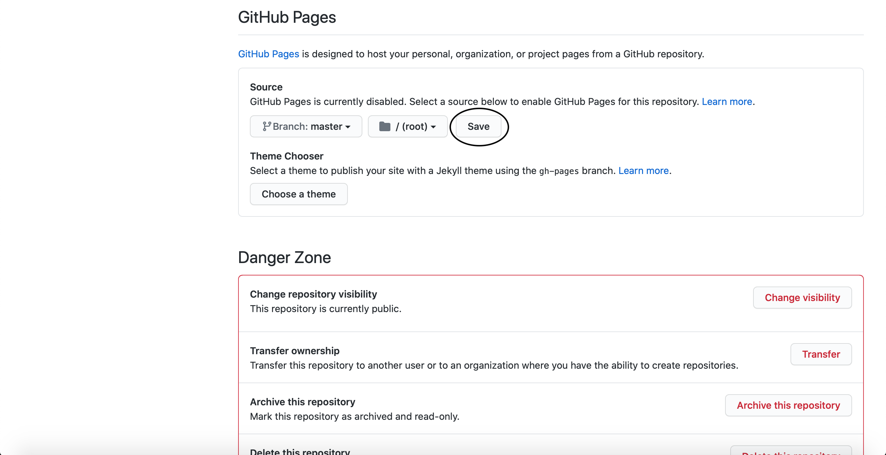
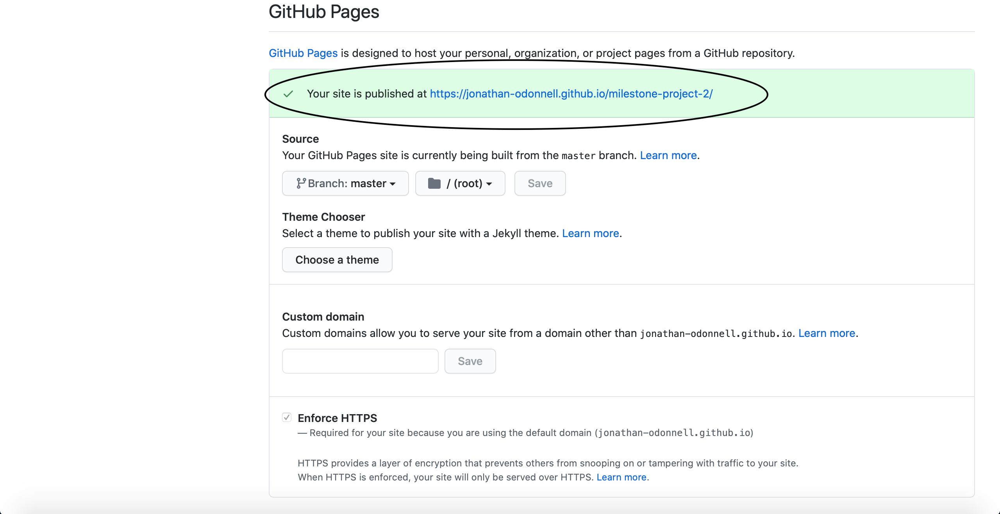
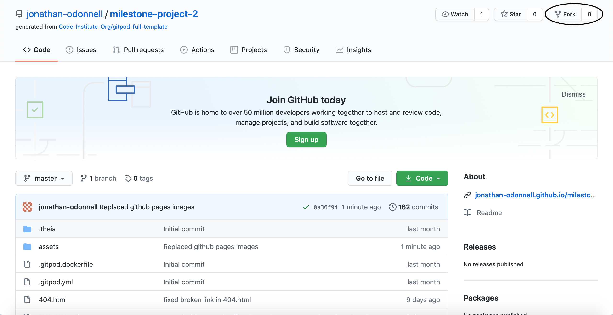
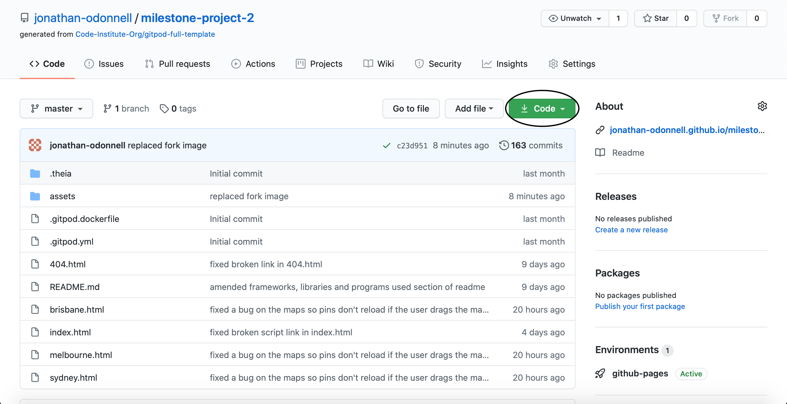
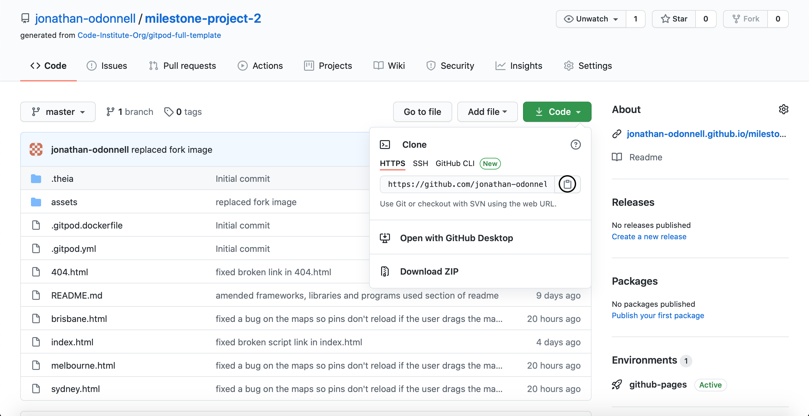
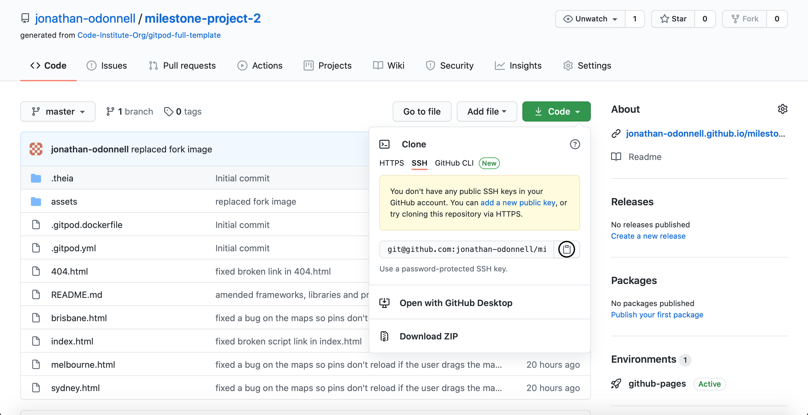

# Discover Australia Website



[View the live website here](https://jonathan-odonnell.github.io/milestone-project-2/)

Discover Australia is a fictitious tourism board based in Sydney, Australia. This is the organisation's main marketing website which aims to promote the different holiday destinations in Australia to potential customers in order to persuade them to book a holiday to Australia through one of their partners. It provides customers with information about the attractions, hotels, restaurants, bars and places to shop which are available in each destination. The website is designed to be responsive and easy to navigate on a range of devices.

## User Experience (UX)

### User Stories

1. To be able to navigate the website easily to find the content I am looking for.
2. To be able to find out about the top attractions in Australia.
3. To be able to gain an understanding of the experiences that are available in Australia.
4. To be able to find out what destinations there are in Australia.
5. To be able to find out why I should want to visit each destination.
6. To be able to find out about the attractions, hotels, restaurants, cafes bars and shops in each destination.
7. To be able to contact the organisation to get answers to any questions I may have.
8. To be able to find the organisation's social media links.

### Design

#### Colour Scheme

- The three main colours used in the website are white, light blue and dark blue.
- These colours were chosen because the white/light blue contrasts with the dark blue.

#### Typography

- The main font used throughout the website is Montserrat.
- This font was chosen because it makes the content easy to read.
- Sans Serif is the fallback font which is used in the event that the specified font fails to import into the website correctly.

#### Imagery

- The hero images were chosen because they give the user an idea of what they can expect to experience in each destination if they book a holiday there.

### Wireframes

- [Desktop](assets/wireframes/desktop_wireframes.pdf)
- [Tablet](assets/wireframes/tablet_wireframes.pdf)
- [Mobile](assets/wireframes/mobile_wireframes.pdf)

## Features

### Existing Features

1. Brand Logo

   - This familiarises users with the organisation's logo and is also a link which the user can access from any page to take them back to the home page.

2. Navigation links

   - These enable users to access the different pages of the website so they can easily find the content they are looking for.

3. Home Page Hero Image Slider

   - This provides users with an image which gives them an idea of the kind of experience they can expect if they visit the destination and a link to the destination's page.

4. Discover the Best of Australia Carousel

   - This enables users to find out about the top attractions across Australia and view key information about each attraction such as an image of the attraction, it's name, it's rating and a link to it's Google page.

5. Gallery

   - This allows users to view images which give them an idea of the kind of experience they can expect if they visit Australia.

6. Destination Hero Image

   - This provides users with an idea of the kind of experience they can expect if they visit the destination.

7. Dropdown Menu

   - This enables the user to select the type of places they would like to be displayed on the map. A new search is then conducted and new markers are displayed on the map.

8. Google Map

   - This displays a map of the destination's city centre with a markers for up to 20 of the top attractions returned by the place search. If the user drags the map, a new search will be conducted based on the new center of the map, and new markers will be displayed on the map. 

9. Info Window

   - This provides users with the place's name, address, telephone number, rating, website link and place type icon. The relevant info window is opened when the user clicks on a marker or a results table row.

10. Place Search Results Table

    - This displays the marker, name and vicinity for each result returned by the place search.

11. Contact us form

    - This enables users to contact the organisation about any questions they may have by completing the form.

12. Social Media links

    - These provide users with links to the different social media platforms where the organisation has a presence.

13. Responsive Design

    - Bootstrap grids and CSS media queries are used throughout the website to ensure that it is optimised for use on devices with a wide range of screen sizes.

### Features Left to Implement

1. More Destinations

   - Add more destinations including city, costal and countryside destinations.

2. Check in Date Selector

   - Add a check in date selector which is displayed when the user selects hotels from the main map dropdown.

3. Length of Stay Dropdown

   - Add a length of stay dropdown which is displayed when the user selects hotels from the main map dropdown.

4. Hotel Price Markers

   - Display the price per night as the marker for each hotel. This information can be obtained by conducting a hotel prices search using the Google Hotel Prices API.

5. Add Attraction Entry Prices to info windows.

   - Amend the attraction info windows to include the attraction's entry price. This information can be obtained by conducting a place details search using the Sygic Travel API.

6. Add Restaurant Price Levels to info windows.

   - Amend the restaurant info windows to include the restaurant's price level. This information can be obtained by amending the place details search.

7. Add Hotel Star Rating and Facilities to info windows.

   - Amend the hotel info windows to include hotel star rating and details of hotel facilities. This information can be obtained by conducting a hotel content search using the Google Hotel Content API.

8. Custom Markers

   - Add custom markers for each type of place (excluding hotels).

## Technologies Used

### Languages Used

1. [HTML5:](https://en.wikipedia.org/wiki/HTML5)
   - HTML5 was used for the sturcture of the webpages.
2. [CSS3:](https://en.wikipedia.org/wiki/Cascading_Style_Sheets)
   - CSS3 was used for the styling of the webpages.
3. [JavaScript:](https://en.wikipedia.org/wiki/JavaScript)
   - JavaScript was used for the interactive features on the webpages.

### Frameworks, Libraries & Programs Used

1. [Bootstrap 4.4.1](https://getbootstrap.com/)
   - Bootstrap was used for the jumbotron containing the hero image text, testimonials carousel, menu items cards, nutritional information modals contact us form. Bootstrap was also used for the grid which assists with the responsiveness of the website and for the styling.
2. [Hover.css](https://ianlunn.github.io/Hover/)
   - Hover.css was used for the hover effects on the navbar links and social media icons.
3. [Google Fonts](https://fonts.google.com/)
   - Google fonts was used to import the 'Montserrat' font into the style.css file which is used on all pages throughout the project.
4. [Font Awesome](https://fontawesome.com/)
   - Font Awesome was used throughout the website to enhance the user experience by adding icons.
5. [Popper.js](https://popper.js.org/)
   - Bootstrap uses Popper.js to make the navbar responsive.
6. [jQuery](https://jquery.com/)
   - JQuery was used throughout the website for the interactive features.
7. [Google Maps API](https://developers.google.com/maps/documentation/javascript/overview)
   - Google Maps API was used for the maps on each destination page.
8. [Google Places API](https://developers.google.com/places/web-service/overview)
   - Google Places API was used for the place details in the discover the best of Australia carousel, results tables and map information windows.
9. [Instagram Grabber API](https://rapidapi.com/victor.beck123123/api/instagram-grabber/endpoints)
   - Instagram Grabber API was used to request the images used in the gallery.
10. [Cities Slider](https://codepen.io/suez/pen/OjGQza)
    - Cities Slider was used for the hero image slider. License is [here](assets/licenses/cities-slider-license.md).
11. [Owl Carousel 2.3.4](https://owlcarousel2.github.io/OwlCarousel2/)
    - Owl Carousel was used for the discover the best of Australia carousel. License is [here](assets/licenses/owl-carousel-license.md).
12. [Gitpod](https://www.gitpod.io/)
    - Gitpod was used to write the code for this project and gitpod terminal was used to commit changes to Git and Push them to GitHub.
13. [Git](https://git-scm.com/)
    - Git was the version control system used for this project.
14. [GitHub](https://github.com/)
    - GitHub is used to store the project's code and any other required files.
15. [Balsamiq](https://balsamiq.com/)
    - Balsamiq was used to create the wireframes during the design phase of the project.

## Testing

### WC3 Validation

The W3C Markup Validator and W3C CSS Validator Services were used to validate every page of the project to ensure that the code used in the project was in compliance with the HTML5 and CSS3 standards and that there were no syntax errors.

- [Home](assets/images/validation/home.png)
- [Sydney](assets/images/validation/sydney.png)
- [Melbourne](assets/images/validation/melbourne.png)
- [Brisbane](assets/images/validation/brisbane.png)
- [CSS](assets/images/validation/css.png)

### Testing User Stories from User Experience (UX) Section

1. To be able to navigate the website easily to find the content I am looking for.

   - The navigation bar can be easily accessed in the header of each page. 
   - It is clean and easy to read and contains the organisation's logo and the navigation links to the other pages of the website.
   - Each of the navigation links clearly communicates to the user what page it will take them to.
   - The Discover Australia logo is also a link which takes the user back to the home page.
   - The footer also contains key links which take the user to the destination pages and contact us modal.
   - The user can click the back to top button at any time to take them back to the top of the page if they want to access the navigation bar. They can also access links to key parts of the site in the footer.
   - The website is structured in a logical way with the hero image slider, discover the best of Australia carousel and gallery on the Home page, each destination on it's own page and the contact form in a modal which can be opened from any page.

2. To be able to find out about the top attractions in Australia.

   - The discover the best of Australia carousel is clearly highlighted on the home page.
   - Here there is information about the top attractions across Australia including an image of the attraction, it's name, it's rating and a link to it's Google page.

3. To be able to gain an understanding of the experiences that are available in Australia.

   - The gallery section is clearly highlighted on the home page.
   - This contains images which gives the user an idea of the kind of experiences they can expect if they visit Australia.

4. To be able to find out what destinations there are in Australia.

    - The hero image slider section is clearly highlighted on the home page.
    - Here each destination is featured along with a hero image which provides users with an idea of the kind of experience they can expect if they visit the destination and a link to the destination's page.

5. To be able to find out why I should want to visit each destination.

   - A link to each destination's page is clearly highlighted in the navigation bar, hero image slider and footer.
   - Here there is a hero image which provides users with an idea of the kind of experience they can expect if they visit the destination.
   - There is also a quote on each destination page which provides the user with a reason why they should want to visit that destination. 

6. To be able to find out about the attractions, hotels, restaurants, cafes bars and shops in each destination.

   - A link to each destination page is clearly highlighted in the navigation bar hero image slider and footer.
   - Here there is a Google Map and results table displaying up to 20 of the top attractions in the destination.
   - If the user selects an option from the dropdown, a new search will be conducted for that type of place and new markers will be displayed on the map.
   - If the user drags the map, a new search will be conducted based on the new center of the map, and new markers will be displayed on the map.  
   - If the user clicks on a marker in the map or table row in the results table, an info window will open which contains the place's name, address, telephone number, rating, website link and place type icon.

7. To be able to contact the organisation to get answers to any questions I may have.

   - A link to the contact us modal is clearly highlighted in the navigation bar and in the footer.
   - Here there is a form which the user can complete to get in touch with the organisation.

8. To be able to find the organisation's social media links.

    - The social media icons are clearly highlighted in the footer of each page.
    - Each of these provides a link to the relevant social media platform.

### Manual Testing

Details of the manual testing carried out can be viewed [here](testing.md).

### Jasmine Testing

### Further Testing

- The Website was tested on a variety of different web browsers including Google Chrome, Microsoft Edge and Safari.
- The Website was also viewed on a number of different devices with a range of screen widths including an iMac, MacBook, iPad and iPhone.
- Family and friends were asked to review the site and documentation and identify any bugs or other issues that were affecting the user experience.

### Fixed Bugs

1. Back to top button was appearing much larger than expected on hover.

   - Fixed error in code which was allowing the social media icons hover effect to override the back to top button hover effect.

2. When the contact form modal was closed the navbar was still expanded and the links remained in active status.

   - Added jQuery to fix the issue.

3. Hero image slider was not loading.

   - Moved the hero-image-slider.js script to the bottom of the body tag so the script wasn't loaded until after the DOM had loaded.

4. Images in the discover the best of Australia carousel were not being returned by the Google Places API.

   - Took my account out of trial mode in the Google Console.
   
5. Google Maps markers were reloading when the user dragged the map a very short distance.

   - Added code to prevent a new search from being conducted if the center of the map had changed by less than 500m.

6. Google Maps markers were reloading when the user scrolled over the map on touch screen devices.

   - Added code to prevent a new search from being conducted if the center of the map had not changed.

7. Results table spinner was not appearing both horizontally and vertically centered.

   - Fixed an error in the code preventing the spinner from displaying in the correct position.

8. Info windows were appearing with the previous result or no result in them.

   - Changed the code to ensure that the results had been returned before the info window was opened.

### Known Bugs

- Images in the discover the best of Australia carousel randomly fail to be returned by the Google Places API when the getURL function is called.
- Images in the gallery randomly fail to be returned by the Instagram Getter API.

## Deployment

### GitHub Pages

The project was deployed to GitHub Pages using the following steps:

1.  Log in to GitHub and click on the relelavant [GitHub Repository](https://github.com/jonathan-odonnell/milestone-project-2).
2.  Click on the "Settings" button at the top of the repository.
    
3.  Scroll down to the "GitHub Pages" section.
    
4.  In the source section, click the branch dropdown and select "master".
    
5.  Click save and wait for the page to refresh.
    
6.  Scroll back down to the "Github Pages" section and locate the link to the published site.
    

More information about deploying a website to GitHub Pages is available [here](https://docs.github.com/en/github/working-with-github-pages/creating-a-github-pages-site#creating-your-site).

### Forking the GitHub repository

The GitHub Repository can be forked using the following steps:

1.  Log in to GitHub and locate the project's [GitHub Repository](https://github.com/jonathan-odonnell/milestone-project-2).
2.  At the top-right of the repository, click the "Fork" Button.
    

More information about forking a GitHub repository is available [here](https://docs.github.com/en/github/getting-started-with-github/fork-a-repo).

### Making a Local Clone

A local clone of the project can be created using the following steps:

1.  Log in to GitHub and locate the project's [GitHub Repository](https://github.com/jonathan-odonnell/milestone-project-2).
2.  Under the repository name, click the "Code" button.
    
3.  To clone the repository using HTTPS, under "Clone with HTTPS", click the clipboard button to copy the repository URL.
    
    To clone using SSH click "Use SSH" and then click the clipboard button.
    
    
4.  Open Git Bash
5.  Change the current working directory to the location where you want to store the cloned repository.
6.  Type `git clone` and then paste the URL you copied in Step 3.

```
$ git clone https://github.com/jonathan-odonnell/milestone-project-2.git
```

7.  Press enter to create your clone.

```
Cloning into 'milestone-project-2'...
remote: Enumerating objects: 375, done.
remote: Counting objects: 100% (375/375), done.
remote: Compressing objects: 100% (231/231), done.
remote: Total 671 (delta 219), reused 270 (delta 116), pack-reused 296
Receiving objects: 100% (671/671), 9.99 MiB | 5.69 MiB/s, done.
Resolving deltas: 100% (378/378), done.
```

More information about making a local clone of a GitHub repository is available [here](https://docs.github.com/en/github/creating-cloning-and-archiving-repositories/cloning-a-repository).

## Credits

### Code

- Code for the navbar came from [Bootstrap](https://getbootstrap.com/docs/4.5/components/navbar/).
- Code for the navbar toggler bars icon came from [Font Awesome](https://fontawesome.com/icons/bars?style=solid).
- Code for the navbar toggler times icon came from [Font Awesome](https://fontawesome.com/icons/times?style=solid).
- Code for the navbar toggler interactivity came from [Bootstrap](https://getbootstrap.com/docs/4.5/components/collapse/#collapseshow).
- Code for the hero image slider came from [Codeseek](https://www.codeseek.co/suez/cities-slider-react-OjGQza).
- Code for the discover the best of Australia carousel came from [Codepen](https://codepen.io/Anahiiit/pen/wvGPvaQ).
- Code for the API request for the place details in the discover the best of Australia carousel cards is from [Google](https://developers.google.com/maps/documentation/javascript/places#place_details_requests) and [Stack Overflow](https://stackoverflow.com/questions/23460435/get-google-place-details-without-map).
- Code for the ratings full stars is from [Font Awesome](https://fontawesome.com/icons/star?style=solid).
- Code for the ratings empty stars is from [Font Awesome](https://fontawesome.com/icons/star?style=regular).
- Code for the ratings half stars is from [Font Awesome](https://fontawesome.com/icons/star-half-alt?style=solid).
- Code for the Instagram Getter API request is from [RapidAPI](https://rapidapi.com/victor.beck123123/api/instagram-grabber/endpoints).
- Code for the Facebook icon is from [Font Awesome](https://fontawesome.com/icons/facebook?style=brands).
- Code for the Twitter icon is from [Font Awesome](https://fontawesome.com/icons/twitter?style=brands).
- Code for the Instagram icon is from [Font Awesome](https://fontawesome.com/icons/instagram?style=brands).
- Code for the Youtube icon is from [Font Awesome](https://fontawesome.com/icons/youtube?style=brands).
- Code for the contact form modal is from [Bootstrap](https://getbootstrap.com/docs/4.5/components/modal/).
- Code for the contact form is from [Bootstrap](https://getbootstrap.com/docs/4.5/components/forms/).
- Code for the contact form modal interactivity is from [Bootstrap](https://getbootstrap.com/docs/4.0/components/collapse/).
- Code for the contact form modal interactivity is from [Bootstrap](https://getbootstrap.com/docs/4.0/components/modal/#via-javascript).
- Code to prevent links going back to active status when the contact form modal is closed is from [Stack Overflow](https://stackoverflow.com/questions/30322918/bootstrap-modal-restores-button-focus-on-close).
- Code for the quotes blockquotes is from [Bootstrap](https://getbootstrap.com/docs/4.5/content/typography/#blockquotes).
- Code for the dropdown came from [Bootstrap](https://getbootstrap.com/docs/4.5/components/dropdowns/).
- Code for the map view and list view tabs is from [Bootstrap](https://getbootstrap.com/docs/4.5/components/navs/#tabs).
- Code for the map came from [Google](https://developers.google.com/maps/documentation/javascript/examples/places-autocomplete-hotelsearch).
- Code for the map nearby places search came from [Google](https://developers.google.com/maps/documentation/javascript/places#place_search_requests).
- Code for the map place details search came from [Google](https://developers.google.com/maps/documentation/javascript/places#place_details_requests).
- Code for setting the map info window content came from [Google](https://developers.google.com/maps/documentation/javascript/infowindows).
- Code for the map event listeners came from [Google](https://developers.google.com/maps/documentation/javascript/events).
- Code for preventing the map event listeners from triggering if the map center is changed by less than 500m is from [JSFiddle](https://jsfiddle.net/c2qto3v8/).
- Code for showing and hiding the map markers is from [Google](https://developers.google.com/maps/documentation/javascript/examples/marker-remove).
- Code from the spinner is from [Bootstrap](https://getbootstrap.com/docs/4.5/components/spinners/#about).
- Code for the tables is from [Bootstrap](https://getbootstrap.com/docs/4.5/content/tables/).
- Code for horizontally and vertically centering the spinner and error message in the results table came from [CSS Tricks](https://css-tricks.com/centering-css-complete-guide).
- Code for back to top button icon is from [Font Awesome](https://fontawesome.com/icons/arrow-up?style=solid).
- Code for back to top button styling is from [CoreLangs](http://www.corelangs.com/css/box/shadow.html).
- Code for back to top button interactivity is from [CodePen](https://codepen.io/deveb22/pen/QxPmGz).
- Code for redirecting users back to the home page when the 404 page is reached is from [Stack Overflow](https://stackoverflow.com/questions/49099509/if-404-error-redirect-to-pagenotfound-and-then-redirect-to-home-page).

### Content

- Sydney quote is from [this](https://www.australia.com/en-gb/places/sydney-and-surrounds/guide-to-sydney.html) Tourism Australia page.
- Melbourne quote is from [this](https://www.australia.com/en-gb/places/melbourne-and-surrounds/guide-to-melbourne.html) Tourism Australia page.
- Brisbane quote is from [this](https://www.australia.com/en-gb/places/brisbane-and-surrounds/guide-to-brisbane.html) Tourism Australia page.
- The information in the Github Pages section of the readme was adapted from the GitHub configuring a publishing source for your GitHub Pages site [documentation](https://docs.github.com/en/github/working-with-github-pages/creating-a-github-pages-site#creating-your-site).
- The information in the Forking a Github Repository section of the readme was adapted from the GitHub forking a repository [documentation](https://docs.github.com/en/github/getting-started-with-github/fork-a-repo).
- The information in the Making a Clone section of the readme was adapted from the GitHub cloning a repository [documentation](https://docs.github.com/en/github/creating-cloning-and-archiving-repositories/cloning-a-repository).
- All other content was written by the developer.

### Media

- The brand logo was designed using [Hatchful](https://hatchful.shopify.com/).
- The home page hero image slider Sydney image was from [Shutterstock](https://www.shutterstock.com/image-photo/aerial-view-sydney-australia-drone-shot-1580548351).
- The home page hero image slider Melbourne image was from [Pixabay](https://pixabay.com/photos/central-station-melbourne-victoria-2661255/).
- The home page hero image slider Brisbane image was from [Shutterstock](https://www.shutterstock.com/image-photo/brisbane-city-skyline-river-twilight-australia-657755617).
- The discover the best of Australia images were from the [Google Places API](https://developers.google.com/places/web-service/overview).
- The gallery images were from the [Instagram Grabber API](https://rapidapi.com/victor.beck123123/api/instagram-grabber/endpoints).
- The Sydney page hero image was from [Shutterstock](https://www.shutterstock.com/image-photo/sydney-nswaustralia-surfers-leaving-bondi-beach-1075866242).
- The Melbourne page hero image was from [Shutterstock](https://www.shutterstock.com/image-photo/melbourne-australia-december-18-2016-degraves-558010618).
- The Brisbane page hero image was from [Shutterstock](https://www.shutterstock.com/image-photo/arches-covered-pink-bougainvillea-flowers-southbank-379090987).
- The gallery placeholder images used when no result is returned by the API are from [Placeholder](https://placeholder.com/).

### Acknowledgements

- I received inspiration for this project from [Tourism Australia](https://www.australia.com/).
